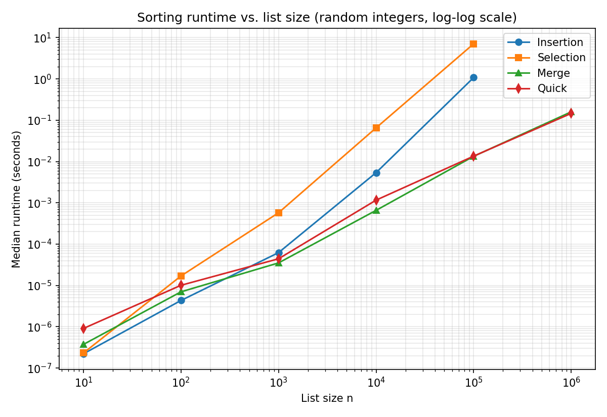

# Sorting Algorithm Benchmarking

To reproduce:

```bash
g++ -std=c++17 -O1 -o sorting sorts.cpp
./sorting
python3 plot.py
```

## The algorithms

**Insertion sort** grows a sorted prefix one element at a time, shifting larger elements right to make room for each new one. It is O(n²) on average, but O(n) on input that is already sorted.

**Selection sort** repeatedly scans the unsorted part of the list for its minimum and swaps it to the front. It always does about n²/2 comparisons, so it is O(n²) no matter what the input looks like.

**Merge sort** splits the list in half, recursively sorts each half, and merges the two sorted halves. It is O(n log n) in every case and uses O(n) extra memory. My version allocates one scratch buffer up front and reuses it for every merge.

**Quick sort** picks a pivot, partitions the list into elements ≤ pivot and ≥ pivot, and recurses on each side. It is O(n log n) on average and O(n²) in the worst case. To avoid the worst case, the pivot is chosen at random (so sorted input isn't a problem) and it uses Hoare partitioning (so lists with many duplicate values don't slow it down). It recurses into the smaller side and loops on the larger one, which keeps the recursion depth at O(log n).

## Testing

**Correctness.** Before timing anything, the program checks every algorithm on edge cases (an empty list, one element, all-equal values, already sorted, reversed, negative numbers), 200 random lists of random lengths, and a 5,000-element list with only 10 distinct values. Insertion sort's output is used as the reference (and is itself checked to be in order), and every other algorithm must produce exactly the same result. Every timed run is also checked to be sorted, so no timing comes from a broken sort.

**Generating lists.** Each list is filled with random integers from 0 to 999,999, generated by `std::mt19937` with a fixed seed (42) so the experiment can be repeated exactly. For each size, all four algorithms sort the *same* lists, so differences come from the algorithms rather than from luckier or unluckier inputs.

**Timing.** Each run is timed with `std::chrono::steady_clock`, a monotonic clock that is the C++ equivalent of Kotlin's `measureTime`. The input is copied into a fresh vector *before* the timer starts, so only the sorting itself is measured. The code was compiled with `-O1` optimization.

**Sizes and repetitions.** I tested n = 10, 100, 1,000, 10,000, 100,000, and 1,000,000. Very short runs are noisy, so the number of trials depends on the size: 201 trials for n ≤ 1,000, 11 for n = 10,000 (and for merge and quick sort at 100,000), 3 for insertion and selection sort at 100,000 (since each run takes seconds), and 5 at 1,000,000. I report the **median** time, which isn't thrown off by occasional slow runs caused by the operating system. Insertion and selection sort were skipped at 1,000,000: following the n² trend, a single selection sort run would take about 100 × 7 s ≈ 12 minutes.

## Results

Median runtime in seconds, random input:

| n | Insertion | Selection | Merge | Quick |
|---:|---:|---:|---:|---:|
| 10 | 2.21e-07 | 2.31e-07 | 3.73e-07 | 9.08e-07 |
| 100 | 4.33e-06 | 1.69e-05 | 7.00e-06 | 1.01e-05 |
| 1,000 | 6.22e-05 | 5.74e-04 | 3.51e-05 | 4.42e-05 |
| 10,000 | 5.37e-03 | 6.53e-02 | 6.57e-04 | 1.16e-03 |
| 100,000 | 1.079 | 7.077 | 0.0134 | 0.0135 |
| 1,000,000 | — | — | 0.160 | 0.146 |



Both axes of the plot use log scales. On a log-log plot, a runtime that grows like nᵏ appears as a straight line with slope k, which makes the growth rates easy to compare.

## Conclusions

The results match the theory. Each time n grows 10×, insertion and selection sort become roughly 100× slower (O(n²)), while merge and quick sort become only about 11–12× slower (O(n log n)). On the plot, this shows up as the two quadratic lines being much steeper than the other two.

For small lists the simple algorithms win: at n = 10 and n = 100, insertion sort is the fastest, and quick sort is the slowest because its recursion and random-pivot overhead dominate when there is little work to do. Somewhere between 100 and 1,000 elements, merge and quick sort take over, and the gap grows quickly. At 100,000 elements, merge sort is about 80× faster than insertion sort and about 500× faster than selection sort.

Among the quadratic sorts, insertion sort is consistently faster than selection sort, because its inner loop can stop early while selection sort always scans the whole remaining list. Merge and quick sort are close: merge sort is somewhat faster up to 10,000 elements, they tie at 100,000, and quick sort is slightly faster at 1,000,000.

In short: insertion sort is a good choice only for small lists, selection sort is never the best choice, and merge or quick sort should be used for anything large.
